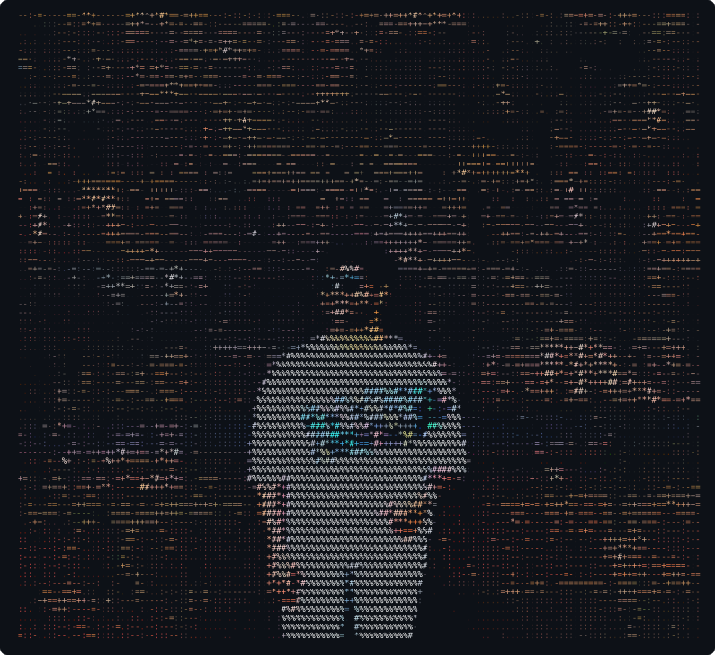

  

### AkhilBabu94@github

- **Uptime:** 9 years, 3 months, 27 days
- **Languages:** TypeScript, Python, Java, JavaScript, HTML

**Contact**

- **GitHub:** [github.com/AkhilBabu94](https://github.com/AkhilBabu94)

**GitHub Stats**

- **Repos:** 17 &nbsp;•&nbsp; **Stars:** 1 &nbsp;•&nbsp; **Followers:** 1

## Hi there 👋

<!--
**AkhilBabu94/AkhilBabu94** is a ✨ _special_ ✨ repository because its `README.md` (this file) appears on your GitHub profile.

Here are some ideas to get you started:

- 🔭 I’m currently working on ...
- 🌱 I’m currently learning ...
- 👯 I’m looking to collaborate on ...
- 🤔 I’m looking for help with ...
- 💬 Ask me about ...
- 📫 How to reach me: ...
- 😄 Pronouns: ...
- ⚡ Fun fact: ...
-->
